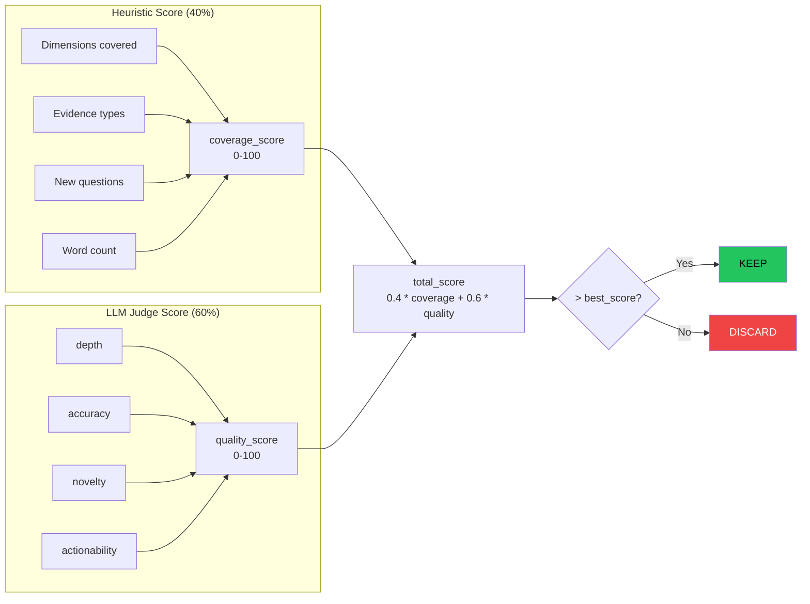

# Autoresearch

Autonomous research framework powered by AI coding agent CLIs.
Adapts [Karpathy's autoresearch pattern](https://github.com/karpathy/autoresearch)
-- replacing GPU training runs with LLM agent calls for deep, iterative research
on any topic.

Supports **Claude**, **Codex**, **Gemini**, and **Copilot** backends with
**multi-backend strategies**: ensemble research, adversarial review, serial
refinement, and specialist routing.

## What This System Is

A **methodologically-aware autonomous research system** -- not a fully
validated scientific research engine.

- Autonomously explores topics across dimensions, accumulates findings,
  compares iterations, and synthesizes a deliverable
- Includes structured rigor: methodology fields, provenance artifacts,
  evaluation layers, inter-rater agreement metrics, and reproducibility metadata
- Still relies on heuristic extraction, LLM judges, and benchmark logic
  that do **not** make its conclusions scientifically true by default

| Question | Answer |
|----------|--------|
| Autonomous agent research system? | Yes |
| Professional research workflow? | Yes |
| Full scientific rigor? | Not yet (see [roadmap](docs/design/scientific-rigor-roadmap.md)) |
| Useful and serious? | Yes |

## Quick Start

```bash
uv sync

# Single backend (Claude)
uv run python -m src.cli --config configs/aws_api_gateway.yaml

# Multi-backend adversarial (codex researches, claude critiques)
uv run python -m src.cli --config configs/localstack_alternatives.yaml

# Resume a previous session
uv run python -m src.cli --config configs/aws_api_gateway.yaml --resume

# Generate synthesis from existing iterations
uv run python -m src.cli --config configs/aws_api_gateway.yaml --synthesize
```

Copy `configs/_template.yaml` to create a new research topic.

## The Pattern

Karpathy's original autoresearch runs an infinite loop on a GPU: modify code,
train for 5 minutes, measure loss, keep or revert. This framework applies the
same loop to knowledge research:

```plaintext
LOOP:
  1. Hypothesis  -- Agent picks the next dimension to investigate
  2. Execute     -- Agent researches it (web search, docs, analysis)
  3. Score       -- Heuristic + LLM judge evaluate findings
  4. Decide      -- Score improved? KEEP and merge. Otherwise: DISCARD.
  5. Log         -- Append to results.tsv, save iteration file
  6. Compress    -- Every N iterations, distill the knowledge base
```

Each iteration produces a scored markdown file. Findings that beat the current
best are merged into a growing knowledge base. The loop stops on Ctrl+C,
`max_iterations`, or `target_dimensions_total`. On exit, a final synthesis
report is generated along with quality metrics and provenance artifacts.

## Architecture

```mermaid
flowchart TD
    START([cli.py --config topic.yaml]) --> INIT[Load config + check backends]
    INIT --> STRAT[Build strategy<br>single / ensemble / adversarial /<br>parallel / serial / specialist]
    STRAT --> CHECK{--resume flag?}
    CHECK -->|Yes| RESUME[Rebuild state from<br>iterations/ + results.tsv]
    CHECK -->|No| FRESH[Initialize empty<br>knowledge base]
    RESUME --> LOOP
    FRESH --> LOOP

    LOOP[[INFINITE LOOP]] --> HYPO

    subgraph ITERATION ["Each Iteration"]
        HYPO[1. HYPOTHESIS<br>primary backend<br>Pick next dimension]
        HYPO --> EXHAUST{Dimension<br>exhausted?}
        EXHAUST -->|Yes, 3+ attempts| SKIP_DIM[Skip, mark explored]
        EXHAUST -->|No| EXEC
        SKIP_DIM --> HYPO
        EXEC[2. EXECUTE<br>strategy.execute_research&#40;&#41;<br>single / parallel / serial]
        EXEC --> CRIT{Post-research?}
        CRIT -->|Adversarial| CRITIQUE[Critique by<br>adversary backend]
        CRIT -->|No| CRASH
        CRITIQUE --> CRASH
        CRASH{Crash?}
        CRASH -->|Yes| LOG_CRASH[Log crash<br>Track attempt count]
        CRASH -->|No| SCORE
        LOG_CRASH --> LOOP
        SCORE[3. SCORE<br>judge backend<br>Heuristic 40% + Judge 60%]
        SCORE --> DECIDE{total > best?}
        DECIDE -->|KEEP| MERGE[Merge findings<br>into knowledge_base.md]
        DECIDE -->|DISCARD| SAVE[Save iteration file<br>but don't merge]
        MERGE --> LOG
        SAVE --> LOG
        LOG[4. LOG to results.tsv]
    end

    LOG --> RATE{Rate limited?}
    RATE -->|>90%| WAIT_LONG[Backoff 120s]
    RATE -->|>80%| WAIT_SHORT[Cooldown 30s]
    RATE -->|OK| COMPRESS
    WAIT_LONG --> COMPRESS
    WAIT_SHORT --> COMPRESS
    COMPRESS{Every N iters?}
    COMPRESS -->|Yes| SHRINK[Compress knowledge base<br>utility backend]
    COMPRESS -->|No| LOOP
    SHRINK --> LOOP

    LOOP -.->|Ctrl+C or stop criteria| SYNTH[Generate synthesis.md<br>primary backend]
    SYNTH --> DONE([Print summary + rubric grade + exit])

    style LOOP fill:#f59e0b,color:#000
    style MERGE fill:#22c55e,color:#000
    style SAVE fill:#94a3b8,color:#000
    style LOG_CRASH fill:#ef4444,color:#fff
    style SYNTH fill:#3b82f6,color:#fff
    style WAIT_LONG fill:#f97316,color:#000
    style STRAT fill:#8b5cf6,color:#fff
    style CRITIQUE fill:#f59e0b,color:#000
```



## Scoring



After synthesis, a **rubric** grades the output on citation coverage, evidence
quality, source diversity, uncertainty reporting, actionability, and
contradiction handling.

When ensemble or parallel strategies produce multiple candidates for the same
dimension, **inter-rater agreement** (Cohen's kappa) is computed across
backends -- quantifying whether independent review is adding real value or
just cost.

Both the rubric grade and agreement metrics are displayed in the CLI
completion banner alongside the run metrics.

## Multi-Backend Strategies

| Strategy | How It Works | Cost | Min Backends |
|----------|-------------|------|-------------|
| **single** | One backend for everything | 1x | 1 |
| **ensemble** | 2 backends research in parallel, different judge | ~1.5x | 2 |
| **adversarial** | Research + critique + adjudication | ~1.3x | 2 |
| **parallel** | All backends independently, best wins | Nx | 2+ |
| **serial** | Cheap backend drafts, precise one refines | ~1.5x | 2 |
| **specialist** | Route dimensions to best-fit backend | 1x | 2+ |

The key principle: **the judge must be a different provider than the
researchers** to avoid self-confirmation bias.

```yaml
# Example: adversarial strategy
research:
  execution:
    strategy: adversarial
    backends:
      primary: claude           # hypothesis + synthesis
      research:
        - codex                 # researcher
        - claude                # adversary (critiques codex's findings)
      judge: codex              # adjudicator (different from critic)
      utility: codex            # compression
```

For detailed strategy diagrams and recommendations, see the strategy tables
in `configs/_template.yaml`.

## Backends

| Backend | Default Model | Budget Cap | Rate Limit Detection | Recommended Role |
|---------|--------------|------------|---------------------|-----------------|
| **claude** | sonnet | Yes | Yes | Primary (hypothesis, judge, synthesis) |
| **codex** | gpt-5.4 | No | No | Research, adversarial judge |
| **gemini** | gemini-2.5-flash | No | No | Utility, cheap research |
| **copilot** | gpt-4.1 | No | No | Research only (no structured JSON) |

Claude shortnames (`sonnet`, `opus`, `haiku`) are automatically translated to
each backend's default model.

## Output Artifacts

Each run produces a directory under `output/<config-name>/`:

**Core artifacts** (always generated):

| File | Description |
|------|-------------|
| `results.tsv` | Experiment log (scores, gaps, cumulative cost/tokens) |
| `knowledge_base.md` | Accumulated research findings |
| `iterations/iter_NNN.md` | Per-iteration markdown files |
| `synthesis.md` | Final synthesized report |
| `run_manifest.json` | Reproducibility metadata (config, env, versions) |
| `metrics.json` | Machine-readable run summary |
| `methods.md` | Human-readable research methodology |

**Provenance artifacts** (always generated):

| File | Description |
|------|-------------|
| `claims.json` | Extracted claims with type and confidence labels |
| `citations.json` | Extracted URLs with source type classification |
| `evidence_links.json` | Claim-to-citation links with support strength |
| `evidence_quality.json` | Run-level evidence quality summary |
| `rubric.json` | Research quality rubric (grade + 6 dimensions) |
| `contradictions.json` | Detected recommendation conflicts |

**Agreement artifacts** (multi-backend runs only):

| File | Description |
|------|-------------|
| `agreement.json` | Inter-rater agreement: per-dimension scores, decision agreement rate, Cohen's kappa |

**Evaluation artifacts** (when configured):

| File | Description |
|------|-------------|
| `baseline.md` | Single-pass baseline answer for comparison |
| `evaluation.json` | Iterative-vs-baseline comparison |
| `comparison.json` | Reference-run consistency analysis |
| `semantic_review.json` | Optional final judge review |
| `semantic_calibration.json` | Calibrated quality score |
| `dashboard.json` | Executive summary |

**Reports** (when configured):

| File | Description |
|------|-------------|
| `report.html` | Stakeholder-facing HTML report |
| `report.pdf` | PDF export |
| `portfolio.json` / `portfolio.html` | Cross-run portfolio aggregation |

## Configuration

See `configs/_template.yaml` for the full reference with inline documentation.

Key fields:

| Field | Default | Description |
|-------|---------|-------------|
| `topic` | (required) | The research question |
| `goal` | same as topic | Desired output description |
| `dimensions` | `[]` | Dimensions to explore |
| `backend` | `claude` | CLI backend |
| `model` | `sonnet` | Model name |
| `max_iterations` | `0` | Max iterations (0 = infinite) |
| `max_budget_per_call` | `0.50` | USD cap per invocation (Claude only) |
| `timeout_seconds` | `600` | Timeout per invocation |
| `strategy` | `single` | Multi-backend strategy |
| `lightweight_mode` | `false` | Short-form output for smoke tests |
| `isolate_backend_context` | `true` | Run backends from isolated temp dirs |
| `sanitize_backend_env` | `true` | Pass reduced subprocess environment |

Optional sections: `methodology:` (academic framing), `evaluation:` (baselines,
benchmarks, semantic review), `reporting:` (HTML/PDF export). See the template
for details.

## Project Structure

```plaintext
src/
    cli.py              Entry point
    config.py           YAML config loader
    orchestrator.py     AutoResearcher -- setup, synthesis, artifact wiring
    research_loop.py    Core iteration loop (hypothesis -> research -> score -> decide)
    scorer.py           Heuristic scoring, LLM-as-judge, inter-rater agreement
    strategy.py         Multi-backend strategies
    provenance.py       Claim/citation extraction, evidence linking, rubric
    comparison.py       Benchmark/reference-run comparison
    semantic_eval.py    Semantic review and calibration
    constraints.py      Goal-shape enforcement, lightweight mode
    artifacts.py        Artifact payload builders, writers, env helpers
    run_state.py        Runtime state helpers (usage tracking, merge, resume)
    run_io.py           Iteration/results filesystem persistence
    reporting.py        HTML report renderer
    pdf_report.py       PDF renderer
    portfolio.py        Cross-run portfolio aggregation
    prompts.py          Prompt template loading
    backends/
        base.py         Backend ABC, subprocess management
        claude.py       ClaudeBackend (rate limits, budget caps)
        codex.py        CodexBackend
        gemini.py       GeminiBackend
        copilot.py      CopilotBackend
        types.py        Shared types (CallOptions, AgentResponse, etc.)
        registry.py     Backend discovery
    templates/          HTML report templates and CSS
configs/
    _template.yaml      Copy this for new topics (full reference)
    smoke_test_*.yaml   Per-backend and per-strategy smoke tests
prompts/                Prompt templates for each phase
benchmarks/             Reusable benchmark definitions
docs/design/            Architecture decision records
tests/                  283 tests across all modules
```

## Resilience

- **Crash recovery**: Dimensions retried up to 3 times, then skipped
- **Resume**: `--resume` rebuilds state from existing iteration files
- **Rate limiting**: Detects rate limits (Claude), backs off 30-120s
- **Budget cap**: Per-call USD limit prevents runaway costs
- **Graceful shutdown**: Ctrl+C generates synthesis before exiting
- **Windows support**: Reliable subprocess kill via `CREATE_NEW_PROCESS_GROUP` + `taskkill /T`
- **Model translation**: Claude shortnames auto-mapped across backends
- **Isolated execution**: Backends run from temp dirs with sanitized env to prevent context leakage

## Requirements

- Python 3.10+
- At least one supported AI coding CLI installed and authenticated:
  - [Claude Code](https://claude.ai/download) (`claude`) -- recommended
  - [OpenAI Codex](https://developers.openai.com/codex) (`codex`)
  - [Google Gemini CLI](https://github.com/google-gemini/gemini-cli) (`gemini`)
  - [GitHub Copilot CLI](https://docs.github.com/en/copilot) (`copilot`)

## Running Tests

```bash
uv sync --group dev
uv run pytest tests/ -v
```

## Design Documents

- `docs/design/evaluation-architecture.md` -- evaluation pipeline rationale, module boundaries, data flow
- `docs/design/scientific-rigor-roadmap.md` -- PRISMA/GRADE-informed roadmap toward scientific rigor

## Related Projects

- [karpathy/autoresearch](https://github.com/karpathy/autoresearch) -- the original GPU-based framework
