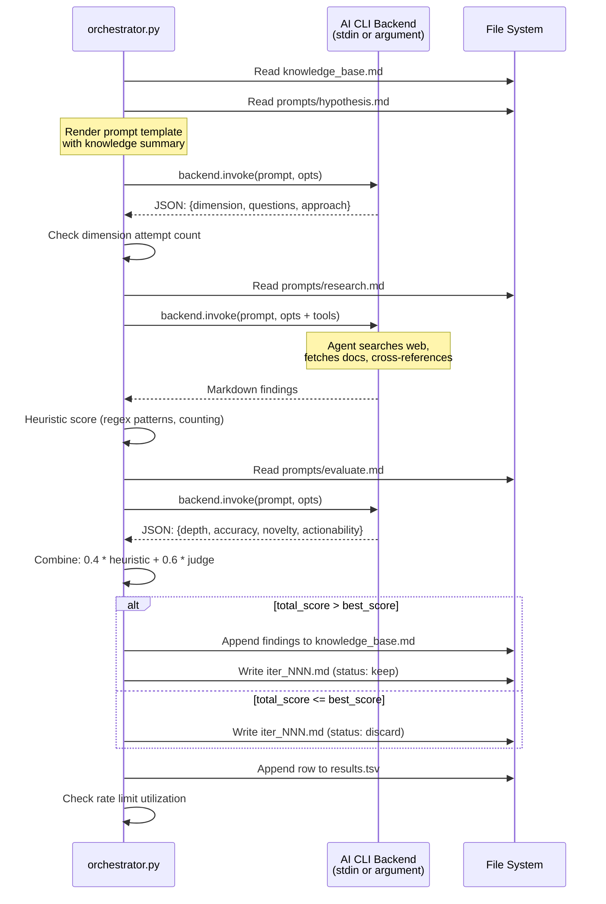
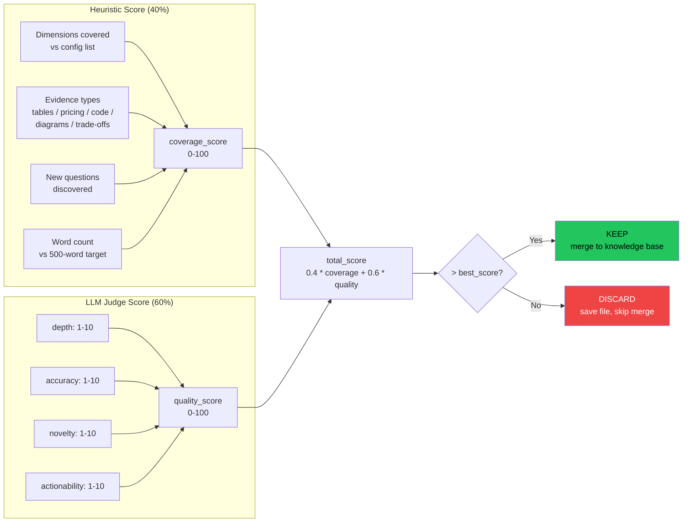
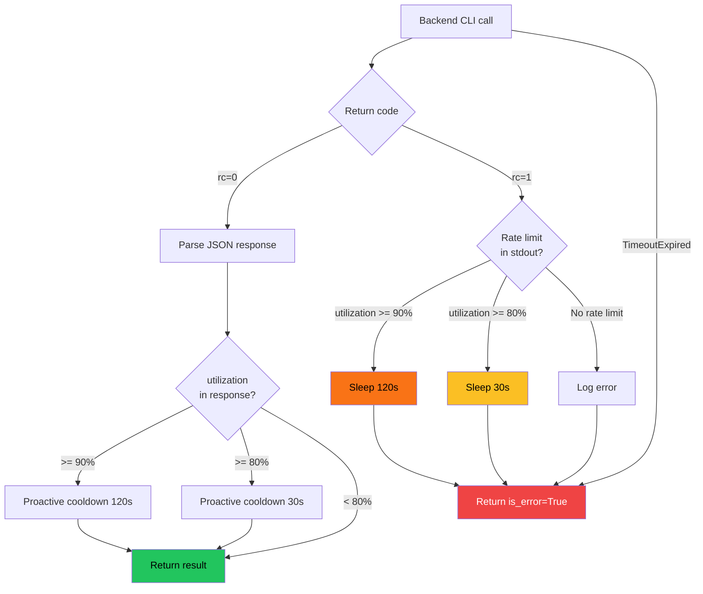

# Autoresearch

Autonomous research framework powered by AI coding agent CLIs.
Adapts [Karpathy's autoresearch pattern](https://github.com/karpathy/autoresearch)
— replacing GPU training runs with LLM agent calls for deep, iterative research
on any topic. Supports **Claude**, **Codex**, **Gemini**, and **Copilot** backends.

## The Pattern

Karpathy's original autoresearch runs an infinite loop on a GPU: modify code,
train for 5 minutes, measure loss, keep or revert. This framework applies the
same loop to knowledge research:

```plaintext
LOOP FOREVER:
  1. Hypothesis  — Agent picks the next dimension to investigate
  2. Execute     — Agent researches it (web search, docs, analysis)
  3. Score       — Heuristic + LLM judge evaluate findings
  4. Decide      — Score improved? KEEP and merge. Otherwise: DISCARD.
  5. Log         — Append to results.tsv, save iteration file
  6. Compress    — Every N iterations, distill the knowledge base
```

Each iteration produces a scored, self-contained markdown file. Findings that
beat the current best are merged into a growing knowledge base. On exit
(`Ctrl+C`) or via `--synthesize`, a final report is generated.

## Architecture

### Main Loop

```mermaid
flowchart TD
    START([cli.py --config topic.yaml]) --> INIT[Load config + check backend CLI]
    INIT --> CHECK{--resume flag?}
    CHECK -->|Yes| RESUME[Rebuild state from<br>iterations/ + results.tsv]
    CHECK -->|No| FRESH[Initialize empty<br>knowledge base]
    RESUME --> LOOP
    FRESH --> LOOP

    LOOP[[INFINITE LOOP]] --> HYPO

    subgraph ITERATION ["Each Iteration (~3 agent calls)"]
        HYPO[1. HYPOTHESIS<br>backend.invoke&#40;prompt&#41;<br>Pick next dimension]
        HYPO --> EXHAUST{Dimension<br>exhausted?}
        EXHAUST -->|Yes, 3+ attempts| SKIP_DIM[Skip, mark explored]
        EXHAUST -->|No| EXEC
        SKIP_DIM --> HYPO
        EXEC[2. EXECUTE<br>backend.invoke&#40;prompt + tools&#41;<br>WebSearch + WebFetch]
        EXEC --> CRASH{Crash?}
        CRASH -->|Yes| LOG_CRASH[Log crash<br>Track attempt count]
        CRASH -->|No| SCORE
        LOG_CRASH --> LOOP
        SCORE[3. SCORE<br>Heuristic 40% + Judge 60%]
        SCORE --> DECIDE{total > best?}
        DECIDE -->|KEEP| MERGE[Merge findings<br>into knowledge_base.md]
        DECIDE -->|DISCARD| SAVE[Save iteration file<br>but don't merge]
        MERGE --> LOG
        SAVE --> LOG
        LOG[4. LOG to results.tsv]
    end

    LOG --> RATE{Rate limited?}
    RATE -->|>90%| WAIT_LONG[Backoff 120s]
    RATE -->|>80%| WAIT_SHORT[Cooldown 30s]
    RATE -->|OK| COMPRESS
    WAIT_LONG --> COMPRESS
    WAIT_SHORT --> COMPRESS
    COMPRESS{Every N iters?}
    COMPRESS -->|Yes| SHRINK[Compress knowledge base]
    COMPRESS -->|No| LOOP
    SHRINK --> LOOP

    LOOP -.->|Ctrl+C or max_iterations| SYNTH[Generate synthesis.md]
    SYNTH --> DONE([Print summary + exit])

    style LOOP fill:#f59e0b,color:#000
    style MERGE fill:#22c55e,color:#000
    style SAVE fill:#94a3b8,color:#000
    style LOG_CRASH fill:#ef4444,color:#fff
    style SYNTH fill:#3b82f6,color:#fff
    style WAIT_LONG fill:#f97316,color:#000
```



### Single Iteration



## Quick Start

```bash
uv sync

# Run with Claude (default backend)
uv run python -m src.cli --config configs/aws_api_gateway.yaml

# Run with a different backend
uv run python -m src.cli --config configs/aws_api_gateway.yaml --backend codex

# Resume a previous session
uv run python -m src.cli --config configs/aws_api_gateway.yaml --resume

# Generate synthesis from existing iterations
uv run python -m src.cli --config configs/aws_api_gateway.yaml --synthesize
```

## Requirements

- Python 3.10+
- At least one supported AI coding CLI installed and authenticated:
  - [Claude Code](https://claude.ai/download) (`claude`)
  - [OpenAI Codex](https://developers.openai.com/codex) (`codex`)
  - [Google Gemini CLI](https://github.com/google-gemini/gemini-cli) (`gemini`)
  - [GitHub Copilot CLI](https://docs.github.com/en/copilot) (`copilot`)

## Project Structure

```plaintext
autoresearch/
    src/
        cli.py              Entry point (--config, --backend, --resume, --synthesize)
        config.py           YAML config loader with frozen dataclasses
        backend.py          Backend ABC + Claude, Codex, Gemini, Copilot implementations
        orchestrator.py     AutoResearcher class — the infinite loop
        scorer.py           Heuristic scoring + LLM-as-judge
    configs/
        aws_api_gateway.yaml   Demo: AWS API Gateway comparison
        _template.yaml         Copy this for new research topics
    prompts/
        hypothesis.md       Picks next dimension to explore (returns JSON)
        research.md         Deep research with web search tools
        evaluate.md         LLM judge: depth, accuracy, novelty, actionability
        synthesize.md       Final report generation
    tests/                  Test suite (pytest, 119 tests)
    output/                 Runtime artifacts (gitignored)
        <config-name>/
            results.tsv         Experiment log (TSV)
            knowledge_base.md   Accumulated findings
            iterations/         Per-iteration markdown files
            synthesis.md        Final synthesized report
```

## Creating a New Research Topic

1. Copy `configs/_template.yaml` to `configs/your_topic.yaml`.
2. Fill in the fields:

    ```yaml
    research:
      topic: "Your research question"
      goal: "What the final deliverable should look like"
      dimensions:
        - "First dimension to explore"
        - "Second dimension to explore"
      execution:
        backend: claude        # claude, codex, gemini, or copilot
        model: sonnet          # see model reference below
        max_iterations: 0
        max_turns: 10
        max_budget_per_call: 0.50
        timeout_seconds: 600
        compress_every: 5
    ```

3. Run: `uv run python -m src.cli --config configs/your_topic.yaml`

## Configuration Reference

| Field | Default | Description |
|-------|---------|-------------|
| `topic` | (required) | The research question |
| `goal` | same as topic | Description of desired output |
| `dimensions` | `[]` | Dimensions to explore |
| `backend` | `claude` | CLI backend: `claude`, `codex`, `gemini`, or `copilot` |
| `model` | `sonnet` | Model name (backend-specific, see table below) |
| `max_iterations` | `0` | Max iterations (`0` = infinite) |
| `max_turns` | `10` | Agent turns per research call |
| `max_budget_per_call` | `0.50` | USD cap per invocation (Claude only) |
| `timeout_seconds` | `600` | Timeout per invocation in seconds |
| `compress_every` | `5` | Compress knowledge base every N iterations |
| `allowed_tools` | `WebSearch,...` | Tools available to the research agent |
| `min_dimensions_per_iteration` | `1` | Min dimensions expected per iteration |
| `target_dimensions_total` | `10` | Target total dimensions to cover |
| `evidence_types` | see template | Evidence types for heuristic scoring |

### Models by Backend

| Backend | Top Model | Recommended | Budget |
|---------|-----------|-------------|--------|
| **claude** | `opus` | `sonnet` | `haiku` |
| **codex** | `gpt-5.4` | `gpt-5.4-mini` | `gpt-5.3-codex` |
| **gemini** | `gemini-3.1-pro-preview` | `gemini-3-flash-preview` | `gemini-2.5-flash` |
| **copilot** | `claude-opus-4.6` | `claude-sonnet-4.6` | `gpt-5.4-mini` |

## How Scoring Works



**Heuristic (40%)** — deterministic, fast:
- Dimensions covered vs config list
- Evidence types found (tables, pricing, code, trade-offs)
- New questions discovered
- Substantive word count

**LLM Judge (60%)** — qualitative, via a separate agent call:
- Depth (1-10): beyond surface-level feature lists?
- Accuracy (1-10): verifiable facts, qualified claims?
- Novelty (1-10): new information vs prior knowledge base?
- Actionability (1-10): could a decision-maker act on this?

Combined: `total = 0.4 * heuristic + 0.6 * judge`. If `total > best_score`,
findings are merged into the knowledge base (**KEEP**). Otherwise, the iteration
file is saved but findings are not merged (**DISCARD**).

## Resilience



- **Crash recovery**: Dimensions are retried up to 3 times, then skipped.
- **Resume**: `--resume` rebuilds state from existing iteration files and TSV.
- **Rate limiting**: Detects rate limit events (Claude), backs off 30-120s.
- **Budget cap**: `--max-budget-usd` per call prevents runaway costs (Claude).
- **Large prompts**: Piped via stdin to avoid the Windows 32KB command-line limit.
- **Graceful shutdown**: `Ctrl+C` generates a synthesis report before exiting.
- **Config validation**: Model, budget, timeout, and required fields are validated
  on load with clear error messages.

## Mapping to the Original

| Karpathy's autoresearch | This framework |
|-------------------------|----------------|
| `train.py` (model code) | Research config YAML |
| `uv run train.py` | `<backend> -p - --model <model>` |
| `val_bpb` (lower = better) | `total_score` (higher = better) |
| `git commit` / `git reset` | Merge / skip findings in knowledge base |
| `results.tsv` | `results.tsv` (same pattern, research metrics) |
| `program.md` | Orchestrator + prompt templates |
| 5-minute time budget | `--max-turns` + `--timeout` per call |
| Single GPU | Any supported AI CLI (no hardware required) |

## Demo Results: AWS API Gateway

The included demo config (`configs/aws_api_gateway.yaml`) was run to completion:

- **13 iterations** across 3 sessions
- **3 kept** (scores: 85.2, 89.5, 92.5)
- Dimensions covered: REST vs HTTP API, WebSocket API, authentication,
  rate limiting, integration patterns, observability, deployment, cost modeling
- Final synthesis: 400+ lines, architect-grade comparison report
- Total cost: ~$2 (run with Claude backend)

```bash
uv run python -m src.cli --config configs/aws_api_gateway.yaml --synthesize
```

## Running Tests

```bash
uv sync --group dev
uv run pytest tests/ -v
```

119 tests covering all modules (backend, config, scorer, orchestrator, cli).

## Related Projects

- [karpathy/autoresearch](https://github.com/karpathy/autoresearch) — the original GPU-based framework
