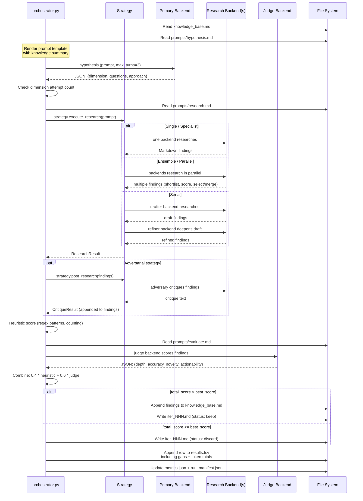
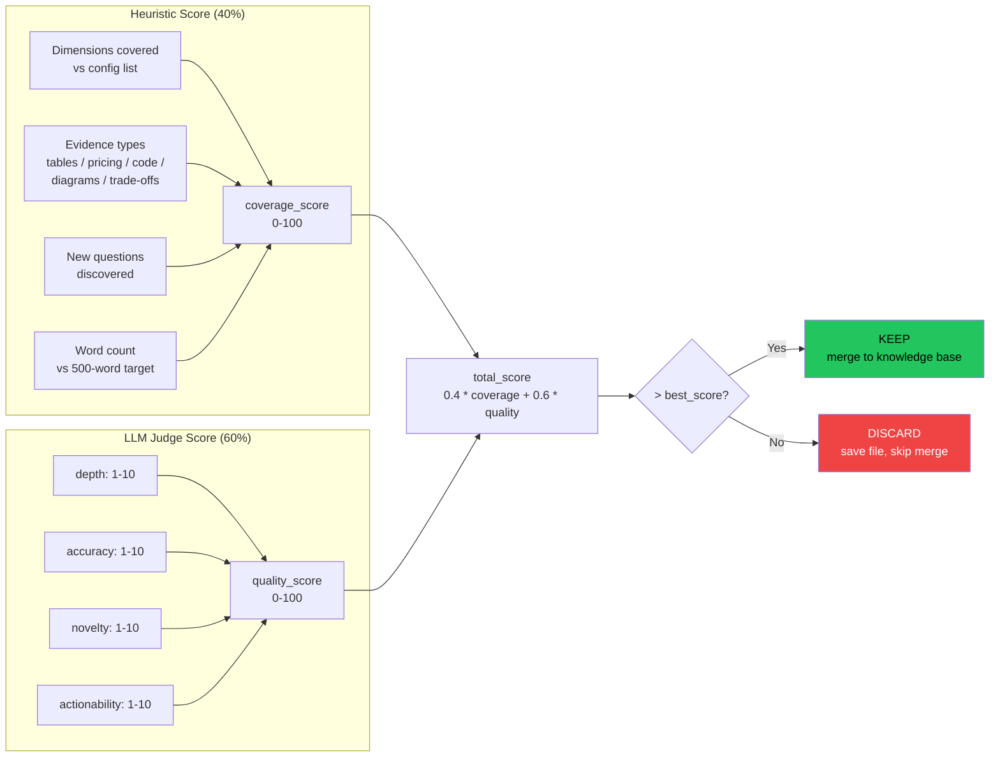
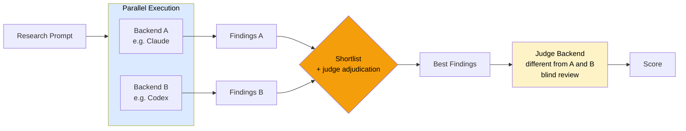
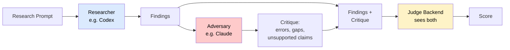
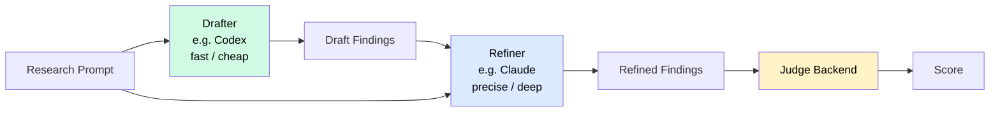
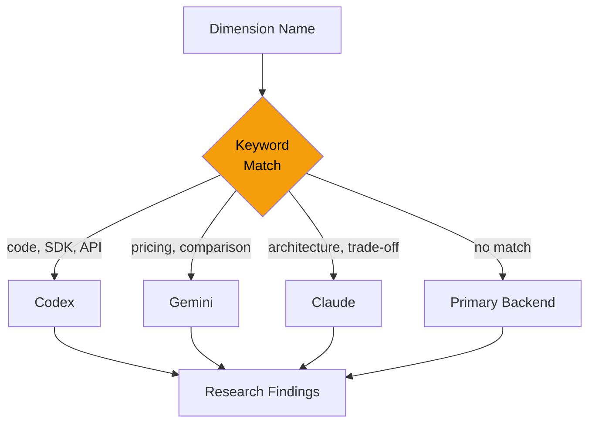
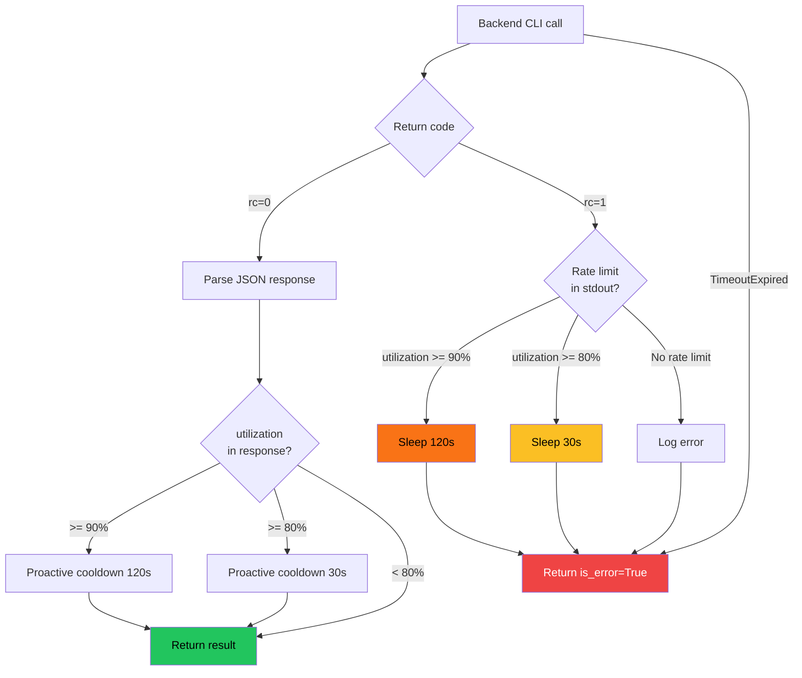

# Autoresearch

Autonomous research framework powered by AI coding agent CLIs.
Adapts [Karpathy's autoresearch pattern](https://github.com/karpathy/autoresearch)
— replacing GPU training runs with LLM agent calls for deep, iterative research
on any topic. Supports **Claude**, **Codex**, **Gemini**, and **Copilot** backends
with **multi-backend strategies** for scientific validation: ensemble research,
adversarial review, serial refinement, and specialist routing.

## Current Status

The project now includes:

- explicit `--resume` semantics
- score-based multi-candidate adjudication for ensemble/parallel strategies
- discovered-dimension queueing with resume persistence
- per-backend cost/token accounting
- reproducibility artifacts (`run_manifest.json`, `metrics.json`, `methods.md`)
- lightweight academic/provenance artifacts (`claims.json`, `citations.json`,
  `evidence_links.json`, `evidence_quality.json`, `contradictions.json`)
- source-quality weighting and evidence-quality scoring
- optional baseline generation and iterative-vs-baseline comparison artifacts
- optional semantic judge review (`semantic_review.json`)
- stakeholder-facing HTML and PDF report generation (`report.html`, `report.pdf`)
- portfolio-level aggregation across runs (`portfolio.json`, `portfolio.html`)
- lightweight mode for smoke tests and short-form deliverables

Test status at the time of this update:

- **256 passing tests**

## Core vs Optional Capabilities

### Core framework

These are the features that define autoresearch itself:

- config loading and backend selection
- hypothesis → research → score → keep/discard loop
- strategy-driven execution (`single`, `ensemble`, `parallel`, `serial`,
  `adversarial`, `specialist`)
- resume support
- per-backend cost/token accounting
- synthesis generation

### Optional research-ops layers

These extend the framework into a research operations suite:

- provenance artifacts (`claims.json`, `citations.json`,
  `evidence_links.json`, `contradictions.json`)
- evidence-quality and rubric scoring
- baseline comparison
- benchmark evaluation
- reference-run consistency comparison
- semantic review and semantic calibration
- HTML/PDF/portfolio reporting

If you only want the core loop, you can ignore the optional evaluation and
reporting artifacts. They are designed to sit on top of the core runtime rather
than redefine it.

For the evaluation architecture rationale, see
`docs/design/evaluation-architecture.md`.

Recent internal refactors extracted:

- goal-shape and lightweight helpers into `src/constraints.py`
- benchmark/reference comparison into `src/comparison.py`
- semantic calibration/review helpers into `src/semantic_eval.py`
- artifact payload builders into `src/artifacts.py`
- runtime state helpers into `src/run_state.py`
- results/iteration persistence helpers into `src/run_io.py`

## The Pattern

Karpathy's original autoresearch runs an infinite loop on a GPU: modify code,
train for 5 minutes, measure loss, keep or revert. This framework applies the
same loop to knowledge research:

```plaintext
LOOP FOREVER:
  1. Hypothesis  — Agent picks the next dimension to investigate
  2. Execute     — Agent researches it (web search, docs, analysis)
  3. Score       — Heuristic + LLM judge evaluate findings
  4. Decide      — Score improved? KEEP and merge. Otherwise: DISCARD.
  5. Log         — Append to results.tsv, save iteration file
  6. Compress    — Every N iterations, distill the knowledge base
```

Each iteration produces a scored, self-contained markdown file. Findings that
beat the current best are merged into a growing knowledge base. The loop stops
when you interrupt it, when `max_iterations` is reached, or when
`target_dimensions_total` explored dimensions have been covered. On exit or via
`--synthesize`, a final report is generated.

## When to Use This Framework

### It Shines When

| Use Case | Why It Works |
|----------|-------------|
| **Technology comparison** ("API Gateway vs ALB vs CloudFront for this pattern") | Iterative exploration covers multiple dimensions; scoring ensures each iteration adds new insight rather than repeating known facts |
| **Architecture decision records** | Produces a scored, evidence-backed report with trade-offs, gaps, and ranked recommendations — ready to share with a team |
| **Pre-project research** ("What should I know before building X?") | Autonomous loop explores dimensions you wouldn't think to ask about; judge-identified gaps can seed new dimensions during the current run |
| **Vendor/tool evaluation** | Multi-backend strategies let different AI providers research independently, reducing provider-specific bias in the findings |
| **Deep-dive on unfamiliar domain** | Compound knowledge: each iteration reads the accumulated knowledge base, so later iterations build on earlier findings rather than starting from scratch |
| **Compliance/security landscape mapping** | Systematic dimension coverage with scoring ensures nothing is skipped; resume support lets you run multiple sessions over days |

### Not Recommended When

| Use Case | Why It Doesn't Fit | Better Alternative |
|----------|-------------------|-------------------|
| **Building a working POC** | Framework researches knowledge, doesn't write/run/test code | Use Claude Code or Codex directly to build the POC, then use autoresearch to research the design decisions |
| **Quick one-off question** | The loop overhead (hypothesis + research + judge) is ~3 minutes per iteration minimum | Just ask Claude/Codex directly |
| **Real-time data** (stock prices, live metrics) | LLM web search is not real-time; findings are point-in-time snapshots | Use APIs + dashboards |
| **Subjective/creative tasks** (naming, copywriting) | The scoring system rewards factual depth and evidence — not creativity | Use an LLM interactively |
| **Code generation or refactoring** | The execute phase produces markdown findings, not runnable code | Use the AI coding CLI directly |
| **Small, well-defined questions** ("What's the max Lambda timeout?") | One search answers it; the iterative loop adds no value | Single prompt |

## Architecture

### Main Loop

```mermaid
flowchart TD
    START([cli.py --config topic.yaml]) --> INIT[Load config + check backends]
    INIT --> STRAT[Build strategy<br>single / ensemble / adversarial /<br>parallel / serial / specialist]
    STRAT --> CHECK{--resume flag?}
    CHECK -->|Yes| RESUME[Rebuild state from<br>iterations/ + results.tsv]
    CHECK -->|No| FRESH[Initialize empty<br>knowledge base]
    RESUME --> LOOP
    FRESH --> LOOP

    LOOP[[INFINITE LOOP]] --> HYPO

    subgraph ITERATION ["Each Iteration"]
        HYPO[1. HYPOTHESIS<br>primary backend<br>Pick next dimension]
        HYPO --> EXHAUST{Dimension<br>exhausted?}
        EXHAUST -->|Yes, 3+ attempts| SKIP_DIM[Skip, mark explored]
        EXHAUST -->|No| EXEC
        SKIP_DIM --> HYPO
        EXEC[2. EXECUTE<br>strategy.execute_research&#40;&#41;<br>single / parallel / serial]
        EXEC --> CRIT{Post-research?}
        CRIT -->|Adversarial| CRITIQUE[Critique by<br>adversary backend]
        CRIT -->|No| CRASH
        CRITIQUE --> CRASH
        CRASH{Crash?}
        CRASH -->|Yes| LOG_CRASH[Log crash<br>Track attempt count]
        CRASH -->|No| SCORE
        LOG_CRASH --> LOOP
        SCORE[3. SCORE<br>judge backend<br>Heuristic 40% + Judge 60%]
        SCORE --> DECIDE{total > best?}
        DECIDE -->|KEEP| MERGE[Merge findings<br>into knowledge_base.md]
        DECIDE -->|DISCARD| SAVE[Save iteration file<br>but don't merge]
        MERGE --> LOG
        SAVE --> LOG
        LOG[4. LOG to results.tsv]
    end

    LOG --> RATE{Rate limited?}
    RATE -->|>90%| WAIT_LONG[Backoff 120s]
    RATE -->|>80%| WAIT_SHORT[Cooldown 30s]
    RATE -->|OK| COMPRESS
    WAIT_LONG --> COMPRESS
    WAIT_SHORT --> COMPRESS
    COMPRESS{Every N iters?}
    COMPRESS -->|Yes| SHRINK[Compress knowledge base<br>utility backend]
    COMPRESS -->|No| LOOP
    SHRINK --> LOOP

    LOOP -.->|Ctrl+C or stop criteria| SYNTH[Generate synthesis.md<br>primary backend]
    SYNTH --> DONE([Print summary + exit])

    style LOOP fill:#f59e0b,color:#000
    style MERGE fill:#22c55e,color:#000
    style SAVE fill:#94a3b8,color:#000
    style LOG_CRASH fill:#ef4444,color:#fff
    style SYNTH fill:#3b82f6,color:#fff
    style WAIT_LONG fill:#f97316,color:#000
    style STRAT fill:#8b5cf6,color:#fff
    style CRITIQUE fill:#f59e0b,color:#000
```



### Single Iteration



## Quick Start

```bash
uv sync

# Run with Claude (default backend, single strategy)
uv run python -m src.cli --config configs/aws_api_gateway.yaml

# Run with a different backend
uv run python -m src.cli --config configs/aws_api_gateway.yaml --backend codex

# Multi-backend: ensemble (parallel research + blind review)
uv run python -m src.cli --config configs/smoke_test_ensemble.yaml

# Multi-backend: adversarial (research + critique + adjudication)
uv run python -m src.cli --config configs/smoke_test_adversarial.yaml

# Override strategy from CLI
uv run python -m src.cli --config configs/aws_api_gateway.yaml --strategy ensemble

# Resume a previous session
uv run python -m src.cli --config configs/aws_api_gateway.yaml --resume

# Generate synthesis from existing iterations
uv run python -m src.cli --config configs/aws_api_gateway.yaml --synthesize
```

## Practical Backend Notes

- **Claude** is still the safest default for smoke tests and general single-backend
  runs.
- **Codex** can produce strong results, but real validation showed **very high token
  usage even on a 1-iteration smoke test**. Prefer it for higher-value research,
  not for the cheapest sanity checks.
- **Gemini** is attractive for utility/compression or low-cost parallel research,
  but free-tier rate limiting can dominate wall-clock time.
- **Copilot** is best treated as a research-only participant in multi-backend
  strategies, not as the judge/hypothesis backend.

## Methodology Support

The framework now supports an optional `methodology:` section in the research
config. Use it when you want runs to be more reproducible or more academically
defensible.

Supported fields:

- `question` — explicit research question framing
- `scope` — intended scope/audience/boundaries
- `inclusion_criteria` — evidence you want preferred
- `exclusion_criteria` — evidence you want avoided
- `preferred_source_types` — ordered source preferences
- `recency_days` — freshness preference for unstable facts

These constraints are:
- written to `methods.md`
- included in `run_manifest.json`
- threaded into hypothesis, research, evaluation, and synthesis prompts

## Provenance and Claim Artifacts

The framework now emits first-pass provenance artifacts:

- `claims.json` — extracted claims with claim type, confidence label, dimension, and cited URLs
- `citations.json` — extracted URL references with inferred source type and retrieval timestamp
- `evidence_links.json` — heuristic links from claims to citations with support-strength labels
- `evidence_quality.json` — run-level summary of direct citation coverage and evidence-quality scores
- `contradictions.json` — detected recommendation conflicts for human review

These artifacts are intentionally lightweight. They are a bridge toward more
academic workflows, not a full scholarly citation engine yet.

## Evaluation and Baselines

The framework now supports an optional `evaluation:` config section:

- `benchmark_id` — identifies the task in a local benchmark definition under `benchmarks/<id>.yaml`
- `run_baselines` — generates a single-pass baseline answer for comparison
- `expected_dimensions` — benchmark dimensions you expect the run to cover (overrides bundled benchmark values when set)
- `required_keywords` — keywords you expect to appear in the final research output (overrides bundled benchmark values when set)
- `reference_runs` — prior output directories to compare against for repeatability and cross-strategy analysis
- `semantic_calibration` — whether to generate a calibrated semantic quality score (enabled by default)
- `semantic_review` — whether to run an optional final judge pass over the synthesis output

The framework also supports an optional `reporting:` config section:

- `export_html` — whether to emit `report.html`
- `export_pdf` — whether to emit `report.pdf`
- `report_title` — optional custom title for the rendered HTML report

For short-answer tasks and smoke tests, the execution config also supports:

- `lightweight_mode` — prefer shorter prompts/artifacts and stricter obedience
  to goals like “bullet list under 100 words”

When enabled, the run emits:

- `baseline.md` — single-pass baseline answer from the synthesis backend
- `evaluation.json` — comparison of iterative synthesis vs baseline, including
  claim/citation counts, evidence-quality summary, rubric results, semantic calibration, bundled benchmark metadata, and benchmark expectation coverage
- `comparison.json` — overlap metrics versus referenced prior runs (dimensions, citations, claims, score deltas, and consistency level)
- `strategy_summary.json` — strategy-level rollups from referenced runs (average score, overlap, and best reference strategy)
- `rubric.json` — lightweight research-quality rubric across evidence quality, citation coverage, source diversity, uncertainty reporting, actionability, and contradiction handling
- `semantic_review.json` — optional final judge review over the synthesized report, including decision-readiness and limitations scoring
- `semantic_calibration.json` — calibrated quality score combining rubric, evidence quality, benchmark coverage, consistency, uncertainty reporting, and contradiction handling
- `dashboard.json` — compact stakeholder summary of benchmark/strategy/rubric status
- `report.html` — stakeholder-facing HTML summary that renders run metadata, methods, synthesis, rubric results, semantic review, and evaluation/comparison summaries
- `report.pdf` — lightweight PDF export derived from final run artifacts
- `portfolio.json` / `portfolio.html` — aggregate summary across sibling run folders for quick portfolio-style review

The HTML report renderer now uses filesystem templates and CSS assets
(`src/templates/report.html.tmpl`, `src/templates/report.css`,
`src/templates/report_print.css`, and `src/templates/partials/`) instead of
embedding the full document directly in Python code, making report
presentation easier to maintain, print, and customize.

The repository now also supports a lightweight benchmark catalog in `benchmarks/`.
Each benchmark YAML can define:

- `benchmark_id`
- `title`
- `description`
- `expected_dimensions`
- `required_keywords`

This lets you keep reusable task expectations in version control instead of duplicating them in each config. See `benchmarks/README.md` for the bundled catalog and naming conventions.

## Requirements

- Python 3.10+
- At least one supported AI coding CLI installed and authenticated:
  - [Claude Code](https://claude.ai/download) (`claude`) -- recommended
  - [OpenAI Codex](https://developers.openai.com/codex) (`codex`)
  - [Google Gemini CLI](https://github.com/google-gemini/gemini-cli) (`gemini`)
  - [GitHub Copilot CLI](https://docs.github.com/en/copilot) (`copilot`) -- install via `npm install -g @github/copilot`

## Project Structure

```plaintext
autoresearch/
    src/
        cli.py              Entry point (--config, --backend, --strategy, --resume, --synthesize)
        config.py           YAML config loader with frozen dataclasses
        orchestrator.py     AutoResearcher class — the infinite loop + model translation
        scorer.py           Heuristic scoring + LLM-as-judge
        strategy.py         Multi-backend strategies (ensemble, adversarial, serial, etc.)
        provenance.py       Claim/citation extraction, evidence links, contradiction checks
        reporting.py        HTML report renderer + template/CSS view-model assembly
        pdf_report.py       Lightweight PDF renderer for artifact-based exports
        portfolio.py        Portfolio aggregation across sibling run directories
        prompts.py          Prompt template loading and rendering
        templates/
            report.html.tmpl HTML report template
            report.css      Main stylesheet for report.html
            report_print.css Print stylesheet for report.html
            partials/       Shared template fragments
        backends/
            __init__.py     Re-exports all public symbols
            types.py        PromptMode, CallOptions, AgentResponse, BackendCapabilities
            base.py         Backend ABC, subprocess management, Windows process kill
            claude.py       ClaudeBackend (rate limits, budget caps, salvage)
            codex.py        CodexBackend
            gemini.py       GeminiBackend
            copilot.py      CopilotBackend
            jsonl.py        Shared JSONL parser
            registry.py     get_backend(), get_backends()
    configs/
        aws_api_gateway.yaml        Demo: AWS API Gateway comparison
        _template.yaml              Copy this for new research topics
        smoke_test_*.yaml           Per-backend and per-strategy smoke tests
    prompts/
        baseline.md         Single-pass baseline answer for evaluation mode
        hypothesis.md       Picks next dimension to explore (returns JSON)
        research.md         Deep research with web search tools
        evaluate.md         LLM judge: depth, accuracy, novelty, actionability
        semantic_judge.md   Optional final semantic judge pass over synthesis
        synthesize.md       Final report generation
        critique.md         Adversarial critique of findings
        refine.md           Serial refinement of draft findings
        merge.md            Merge parallel research outputs
    tests/
        test_backends/      Per-backend tests (independently runnable)
        test_config.py      Config loading and validation
        test_orchestrator.py  Research loop, scoring, resume, stop criteria, accounting
        test_strategy.py    Multi-backend strategy logic
        test_scorer.py      Heuristic + judge scoring
        test_cli.py         CLI argument parsing
        test_reporting.py   Template-based HTML report renderer
    output/                 Runtime artifacts (gitignored)
        <config-name>/
            results.tsv         Experiment log (TSV: scores, gaps, cumulative cost/tokens)
            knowledge_base.md   Accumulated findings
            iterations/         Per-iteration markdown files
            synthesis.md        Final synthesized report
            run_manifest.json   Reproducibility metadata (config snapshot, env, versions)
            metrics.json        Machine-readable run summary and per-backend usage
            methods.md         Human-readable research method + runtime settings
            claims.json        Extracted claims with type/confidence metadata
            citations.json     Extracted URLs with inferred source types
            evidence_links.json Heuristic claim-to-citation links with support labels
            evidence_quality.json Run-level evidence quality summary
            rubric.json         Research-quality rubric summary
            semantic_review.json Optional final judge review of synthesis
            semantic_calibration.json Calibrated semantic quality summary
            contradictions.json Potentially conflicting recommendations for review
            baseline.md       Single-pass baseline answer (optional)
            evaluation.json   Iterative-vs-baseline comparison summary (optional)
            comparison.json   Reference-run consistency summary (optional)
            strategy_summary.json Strategy-level rollup from reference runs (optional)
            dashboard.json    Executive summary artifact (optional)
            report.html       Human-readable HTML report (optional, enabled by default)
            report.pdf        Human-readable PDF report (optional)
        portfolio.json       Cross-run portfolio summary (optional)
        portfolio.html       Human-readable cross-run portfolio dashboard (optional)
```

## Creating a New Research Topic

1. Copy `configs/_template.yaml` to `configs/your_topic.yaml`.
2. Fill in the fields:

    ```yaml
    research:
      topic: "Your research question"
      goal: "What the final deliverable should look like"
      dimensions:
        - "First dimension to explore"
        - "Second dimension to explore"
      execution:
        backend: claude        # claude, codex, gemini, or copilot
        model: sonnet          # see model reference below
        max_iterations: 0
        max_turns: 10
        max_budget_per_call: 0.50
        timeout_seconds: 600
        compress_every: 5
        lightweight_mode: false
    ```

3. Run: `uv run python -m src.cli --config configs/your_topic.yaml`

## Configuration Reference

| Field | Default | Description |
|-------|---------|-------------|
| `topic` | (required) | The research question |
| `goal` | same as topic | Description of desired output |
| `dimensions` | `[]` | Dimensions to explore |
| `backend` | `claude` | CLI backend: `claude`, `codex`, `gemini`, or `copilot` |
| `model` | `sonnet` | Model name (backend-specific, see table below) |
| `max_iterations` | `0` | Max iterations (`0` = infinite) |
| `max_turns` | `10` | Agent turns per research call |
| `max_budget_per_call` | `0.50` | USD cap per invocation (Claude only) |
| `timeout_seconds` | `600` | Timeout per invocation in seconds |
| `compress_every` | `5` | Compress knowledge base every N iterations |
| `lightweight_mode` | `false` | Use shorter prompts/artifacts and stricter short-goal obedience |
| `allowed_tools` | `WebSearch,...` | Tools available to the research agent |
| `strategy` | `single` | Multi-backend strategy (see below) |
| `backends.primary` | same as `backend` | Backend for hypothesis + synthesis |
| `backends.research` | same as `backend` | Backend(s) for research execution |
| `backends.judge` | same as primary | Backend for scoring (blind review) |
| `backends.utility` | same as primary | Backend for compression (cheapest) |
| `min_dimensions_per_iteration` | `1` | Min dimensions expected per iteration |
| `target_dimensions_total` | `10` | Stop once this many dimensions have been explored (in addition to `max_iterations`) |
| `evidence_types` | see template | Evidence types for heuristic scoring |

### Backends: Models, Capabilities, and Limitations

Each backend declares its capabilities via `BackendCapabilities`. The
orchestrator automatically translates Claude model shortnames (`sonnet`,
`opus`, `haiku`) to each backend's default model.

| Backend | Default Model | Prompt Mode | JSON Schema | Budget Cap | Rate Limit Detection |
|---------|--------------|-------------|-------------|------------|---------------------|
| **claude** | `sonnet` | stdin | Yes | Yes | Yes |
| **codex** | `gpt-5.4` | stdin | No | No | No |
| **gemini** | `gemini-2.5-flash` | stdin | No | No | No |
| **copilot** | `gpt-4.1` | argument | No | No | No |

#### Backend-Specific Notes

**Claude** (recommended for single-backend use):
- Full-featured: JSON schema, per-call budget, rate limit backoff, result salvage
- Models: `opus`, `sonnet` (default), `haiku`
- Smoke test: score 82.0, needs `timeout_seconds: 300`

**Codex**:
- Uses `codex exec --json` with stdin prompt delivery
- Models: `gpt-5.4` (default via `~/.codex/config.toml`). Set `features.remote_models = true` for full model list
- Smoke test: score 76.0, full loop + synthesis
- Note: model availability varies by account type (ChatGPT vs API)

**Gemini**:
- Uses `gemini -p ""` with stdin for prompt delivery
- Models: `gemini-2.5-flash` (default), `gemini-2.5-pro`
- Limitation: free tier has aggressive rate limits. The CLI retries
  internally with exponential backoff, consuming the subprocess timeout.
  Works when not rate-limited
- Recommended: use with a paid API key or as a secondary research backend
  in multi-backend strategies where timeouts are tolerable

**Copilot**:
- Uses `copilot -p "prompt"` (argument mode, not stdin)
- Models: `gpt-4.1` (default). Supports multiple providers (OpenAI, Anthropic, Google)
- Install: `npm install -g @github/copilot`
- Limitation: copilot is a **coding agent** — it always tries to explore
  files and run commands. It cannot reliably return structured JSON for
  hypothesis/evaluate phases. **Use only as a research execution backend**
  in multi-backend strategies (ensemble, serial) where Claude handles
  hypothesis + judging

#### Single-Backend Smoke Test Results

| Backend | Hypothesis | Research | Judge | Score | Status |
|---------|-----------|----------|-------|-------|--------|
| claude | JSON output | Markdown findings | JSON scores | 82.0 | Full loop + synthesis |
| codex | JSON output | Markdown findings | JSON scores | 76.0 | Full loop + synthesis |
| gemini | JSON output | Rate-limited | — | — | Fails on free tier |
| copilot | Prose (no JSON) | N/A | N/A | — | Cannot do structured phases |

## How Scoring Works



**Heuristic (40%)** — deterministic, fast:
- Dimensions covered vs config list
- Evidence types found (tables, pricing, code, trade-offs)
- New questions discovered
- Substantive word count

**LLM Judge (60%)** — qualitative, via a separate agent call:
- Depth (1-10): beyond surface-level feature lists?
- Accuracy (1-10): verifiable facts, qualified claims?
- Novelty (1-10): new information vs prior knowledge base?
- Actionability (1-10): could a decision-maker act on this?

Combined: `total = 0.4 * heuristic + 0.6 * judge`. If `total > best_score`,
findings are merged into the knowledge base (**KEEP**). Otherwise, the iteration
file is saved but findings are not merged (**DISCARD**).

## Multi-Backend Strategies

By default, one backend handles every phase. Multi-backend strategies assign
different backends to different roles, applying scientific validation
principles: independent replication and blind peer review.

### Strategy Overview

| Strategy | How It Works | Cost | Min Backends |
|----------|-------------|------|-------------|
| **single** | One backend for everything | 1x | 1 |
| **ensemble** | 2 backends research in parallel, different judge | ~1.5x | 2 |
| **adversarial** | Research + critique + adjudication | ~1.3x | 2 |
| **parallel** | All backends independently, best wins | Nx | 2+ |
| **serial** | Cheap backend drafts, precise one refines | ~1.5x | 2 |
| **specialist** | Route dimensions to best-fit backend | 1x | 2+ |

### When to Use Each Strategy

| Strategy | Recommended When | Not Recommended When |
|----------|-----------------|---------------------|
| **single** | Quick exploration, one provider available, cost-sensitive | Accuracy matters, you have 2+ backends |
| **ensemble** | Default for quality research. Independent replication catches what one backend misses. Blind review eliminates self-confirmation bias | Only 1 backend available, tight budget |
| **adversarial** | Topics where LLMs hallucinate (pricing, benchmarks, limits). The critique phase catches factual errors before scoring | Topic is subjective (no "right answer" to fact-check), tight budget |
| **parallel** | High-stakes research where completeness is critical. Each backend has different training data and blind spots | Budget-constrained (cost scales linearly with backend count) |
| **serial** | Depth over breadth. Pairs a fast/cheap drafter with a precise refiner. Good when one backend is free (gemini) | Both backends are expensive (pays for two full research passes) |
| **specialist** | Dimensions are heterogeneous (some need code, some need pricing, some need reasoning). No cost increase — just smarter routing | All dimensions are similar, only 1 backend available |

### Practical Recommendations

**2 backends (claude + codex)** — most users:
- Use **ensemble** (default) for general research
- Use **adversarial** when accuracy is critical
- Use **serial** when you want depth (codex drafts, claude refines)

**3 backends (claude + codex + gemini)** — ideal:
- Use **ensemble** with codex + gemini researching, claude judging
- True three-way provider separation eliminates all bias
- Gemini free tier handles utility/compression for zero cost

**1 backend (claude only)** — getting started:
- Use **single**, the only option. Still effective — scored 82.0 in testing

**Copilot caveat**: copilot is a coding agent and cannot return structured
JSON. Use it **only as a research backend** in multi-backend strategies
where claude or codex handles hypothesis + judging.

### Ensemble Strategy



Two backends research the same dimension independently. A **different**
backend scores the shortlisted findings without knowing which backend
produced them — blind peer review. In `union` mode, only candidates
above the configured threshold are merged.

### Adversarial Strategy



One backend researches. A second backend critiques the findings for
factual errors and gaps. The judge sees both findings and critique.

### Serial Strategy



A fast/cheap backend does a broad sweep. A precise/expensive backend
reads the draft and deepens, corrects, and adds nuance.

### Specialist Strategy



Routes each dimension to the backend best suited for it based on keyword
matching. No duplication — just smarter routing.

### Backend Role Assignment

The key principle: **the judge must be a different provider than the
researchers** to avoid self-confirmation bias.

| Role | Ideal Backend | Why |
|------|---------------|-----|
| **primary** (hypothesis, synthesis) | claude | Best strategic reasoning |
| **research** | codex + gemini | Independent replication across providers |
| **judge** | claude | Blind review — never touched the research |
| **utility** (compress) | gemini | Cheapest, mechanical task |

### Multi-Backend Config Example

```yaml
research:
  topic: "Your research question"
  execution:
    backend: claude
    strategy: ensemble
    backends:
      primary: claude           # hypothesis + synthesis (best reasoner)
      research:                 # independent replication
        - codex
        - gemini
      judge: claude             # blind review (different provider than researchers)
      utility: gemini           # compression (cheapest)
    strategy_config:
      merge_mode: best          # best | union
      stagger_seconds: 5        # delay between parallel launches
```

## Resilience



- **Crash recovery**: Dimensions are retried up to 3 times, then skipped.
- **Resume**: `--resume` explicitly rebuilds state from existing iteration files and TSV.
- **Rate limiting**: Detects rate limit events (Claude), backs off 30-120s.
- **Budget cap**: `--max-budget-usd` per call prevents runaway costs (Claude).
- **Large prompts**: Piped via stdin to avoid the Windows 32KB command-line limit.
- **Graceful shutdown**: `Ctrl+C` generates a synthesis report before exiting.
- **Windows process kill**: Uses `CREATE_NEW_PROCESS_GROUP` + `taskkill /T`
  to reliably kill child `node` processes on timeout (npm-installed CLIs
  like codex, gemini, copilot spawn node subprocesses that
  `subprocess.run(timeout=...)` cannot kill).
- **Model translation**: Automatically maps Claude shortnames (`sonnet`,
  `opus`, `haiku`) to each backend's native default model in multi-backend
  strategies.
- **Judge validation**: Warns if the judge backend is also a research
  backend (compromises blind review).
- **Config validation**: Model, budget, timeout, strategy, backend names,
  and required fields are validated on load with clear error messages.

## Mapping to the Original

| Karpathy's autoresearch | This framework |
|-------------------------|----------------|
| `train.py` (model code) | Research config YAML |
| `uv run train.py` | `<backend> -p - --model <model>` |
| `val_bpb` (lower = better) | `total_score` (higher = better) |
| `git commit` / `git reset` | Merge / skip findings in knowledge base |
| `results.tsv` | `results.tsv` (same pattern, research metrics) |
| `program.md` | Orchestrator + prompt templates |
| 5-minute time budget | `--max-turns` + `--timeout` per call |
| Single GPU | Any supported AI CLI (no hardware required) |

## Demo Results: AWS API Gateway

The included demo config (`configs/aws_api_gateway.yaml`) was run to completion:

- **13 iterations** across 3 sessions
- **3 kept** (scores: 85.2, 89.5, 92.5)
- Dimensions covered: REST vs HTTP API, WebSocket API, authentication,
  rate limiting, integration patterns, observability, deployment, cost modeling
- Final synthesis: 400+ lines, architect-grade comparison report
- Total cost: ~$2 (run with Claude backend)

```bash
uv run python -m src.cli --config configs/aws_api_gateway.yaml --synthesize
```

## Running Tests

```bash
uv sync --group dev
uv run pytest tests/ -v
```

230 tests covering all modules (backends, config, scorer, orchestrator, cli, strategy, provenance, reporting).
Each backend has independent tests: `uv run pytest tests/test_backends/test_claude.py`

## Related Projects

- [karpathy/autoresearch](https://github.com/karpathy/autoresearch) — the original GPU-based framework
