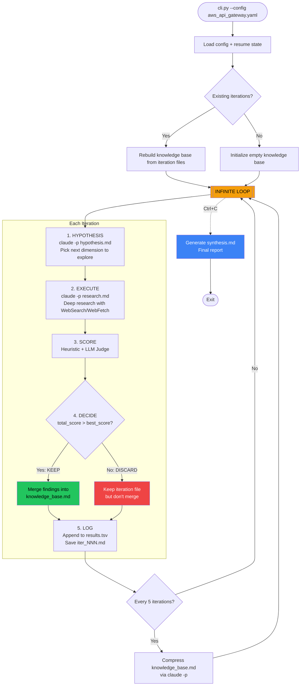
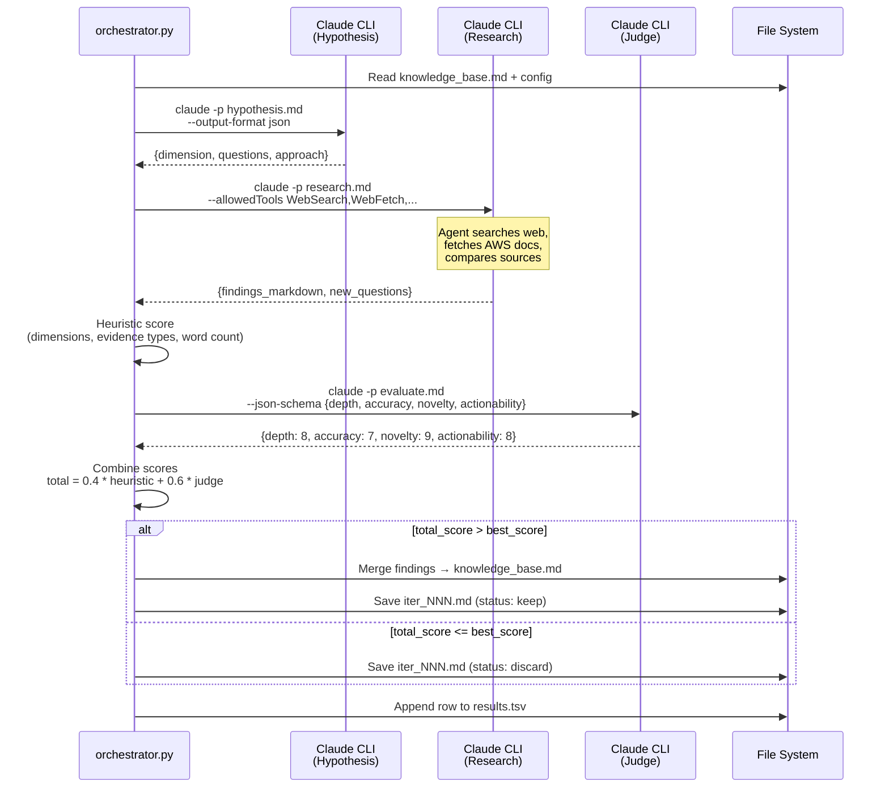
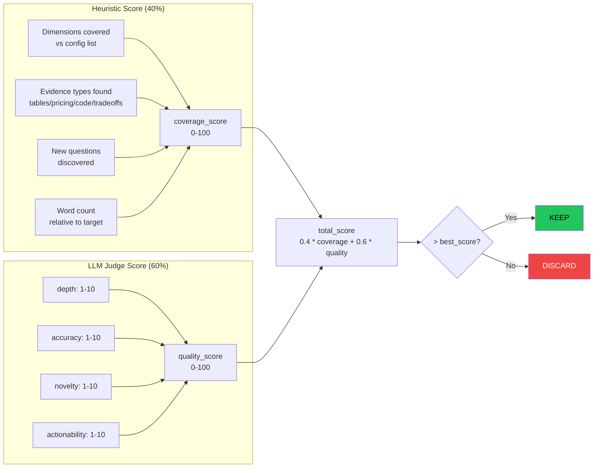
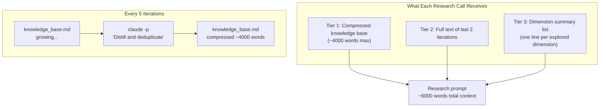
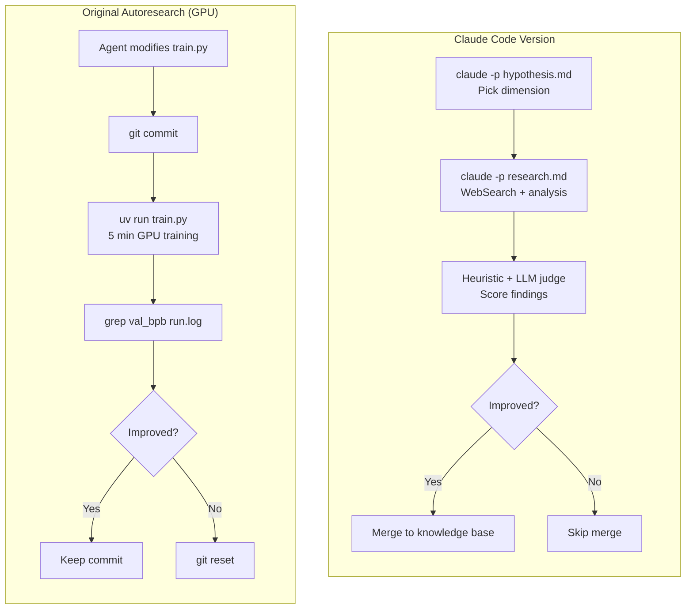
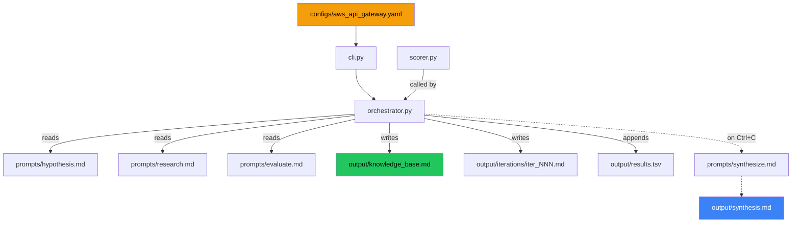

# AutoResearch Claude Code Agent — Architecture Diagrams

## 1. Main Loop Flow

## 2. Sequence Diagram — Single Iteration

## 3. Scoring System

## 4. Context Management — Token Budget

## 5. Mapping: Original vs Claude Code Version

## 6. File Flow

