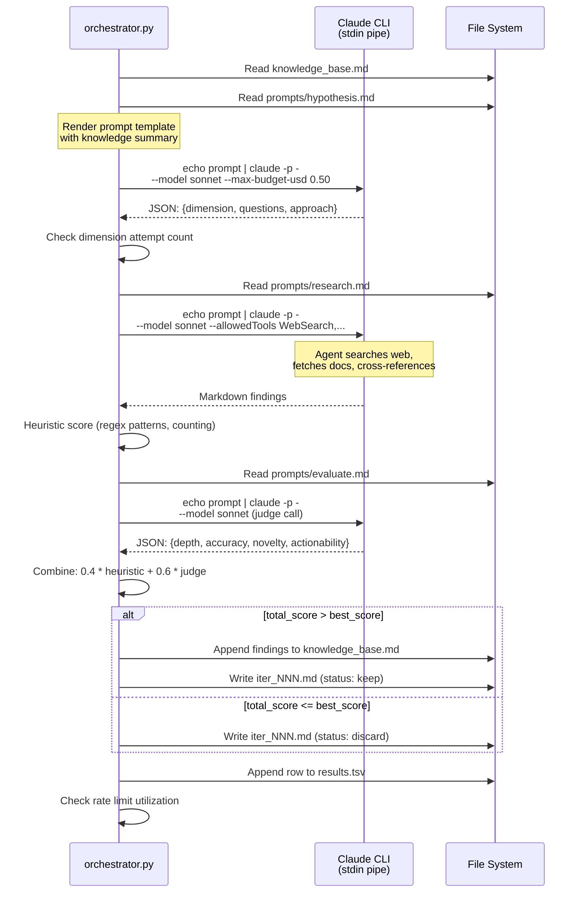
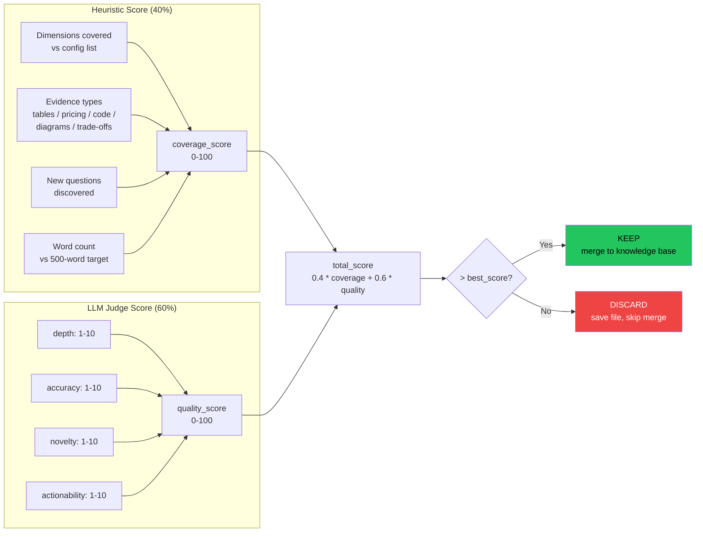
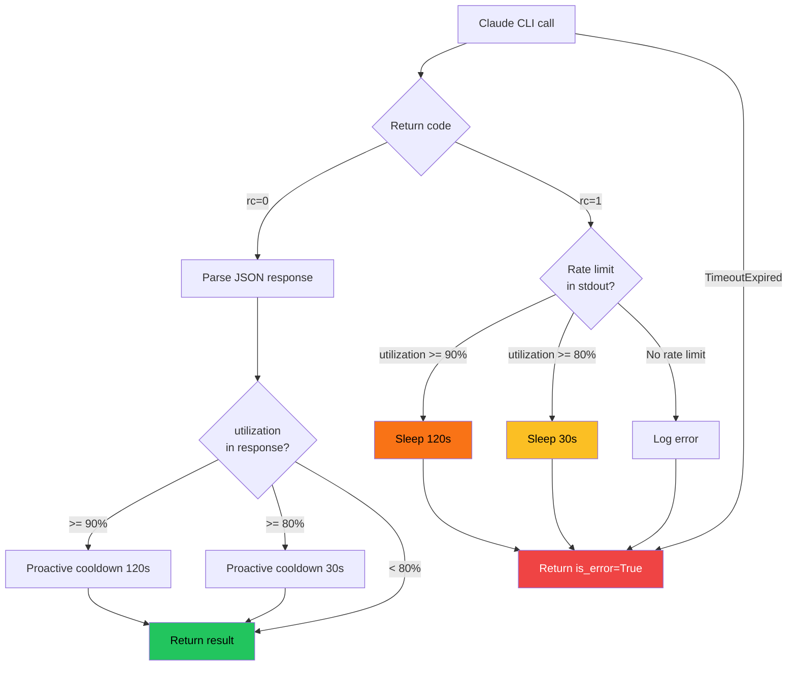
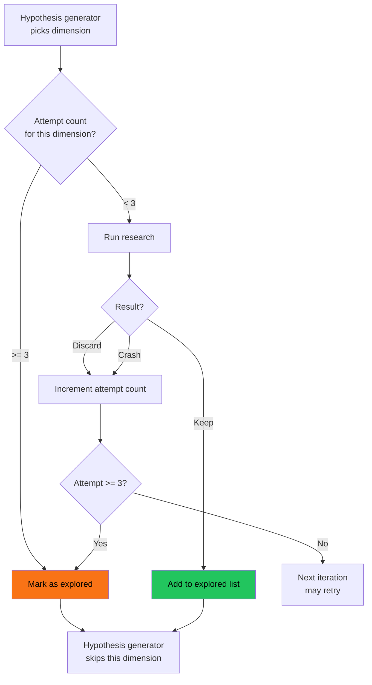
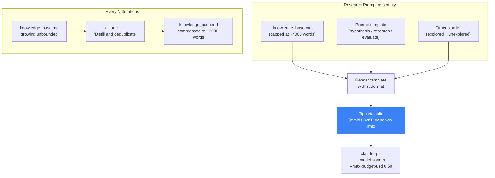
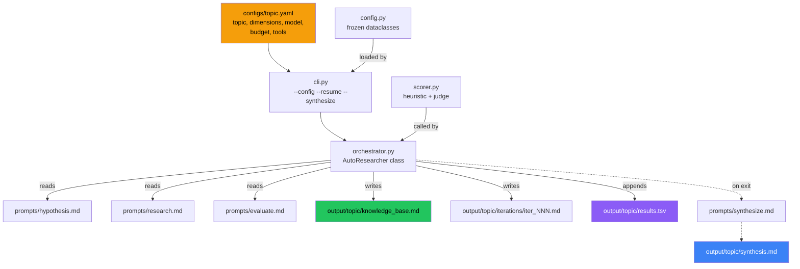
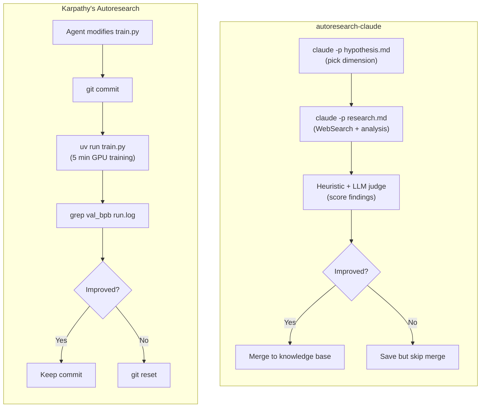

# Architecture Diagrams

Render these with any Mermaid-compatible viewer: VS Code Mermaid extension,
[mermaid.live](https://mermaid.live), or GitHub markdown preview.

## 1. Main Loop

```mermaid
flowchart TD
    START([cli.py --config topic.yaml]) --> INIT[Load config + check claude CLI]
    INIT --> CHECK{--resume flag?}
    CHECK -->|Yes| RESUME[Rebuild state from<br>iterations/ + results.tsv]
    CHECK -->|No| FRESH[Initialize empty<br>knowledge base]
    RESUME --> LOOP
    FRESH --> LOOP

    LOOP[[INFINITE LOOP]] --> HYPO

    subgraph ITERATION ["Each Iteration (~3 Claude calls)"]
        HYPO[1. HYPOTHESIS<br>claude -p - &#60;stdin<br>Pick next dimension]
        HYPO --> EXHAUST{Dimension<br>exhausted?}
        EXHAUST -->|Yes, 3+ attempts| SKIP_DIM[Skip, mark explored]
        EXHAUST -->|No| EXEC
        SKIP_DIM --> HYPO
        EXEC[2. EXECUTE<br>claude --model sonnet<br>WebSearch + WebFetch]
        EXEC --> CRASH{Crash?}
        CRASH -->|Yes| LOG_CRASH[Log crash<br>Track attempt count]
        CRASH -->|No| SCORE
        LOG_CRASH --> LOOP
        SCORE[3. SCORE<br>Heuristic 40% + Judge 60%]
        SCORE --> DECIDE{total > best?}
        DECIDE -->|KEEP| MERGE[Merge findings<br>into knowledge_base.md]
        DECIDE -->|DISCARD| SAVE[Save iteration file<br>but don't merge]
        MERGE --> LOG
        SAVE --> LOG
        LOG[4. LOG to results.tsv]
    end

    LOG --> RATE{Rate limited?}
    RATE -->|>90%| WAIT_LONG[Backoff 120s]
    RATE -->|>80%| WAIT_SHORT[Cooldown 30s]
    RATE -->|OK| COMPRESS
    WAIT_LONG --> COMPRESS
    WAIT_SHORT --> COMPRESS
    COMPRESS{Every N iters?}
    COMPRESS -->|Yes| SHRINK[Compress knowledge base]
    COMPRESS -->|No| LOOP
    SHRINK --> LOOP

    LOOP -.->|Ctrl+C or max_iterations| SYNTH[Generate synthesis.md]
    SYNTH --> DONE([Print summary + exit])

    style LOOP fill:#f59e0b,color:#000
    style MERGE fill:#22c55e,color:#000
    style SAVE fill:#94a3b8,color:#000
    style LOG_CRASH fill:#ef4444,color:#fff
    style SYNTH fill:#3b82f6,color:#fff
    style WAIT_LONG fill:#f97316,color:#000
```

## 2. Single Iteration — Sequence Diagram

## 3. Scoring System

## 4. Resilience — Rate Limiting and Retry

## 5. Dimension Exhaustion

## 6. Context Management

## 7. File Flow

## 8. Original vs Claude Code Version

